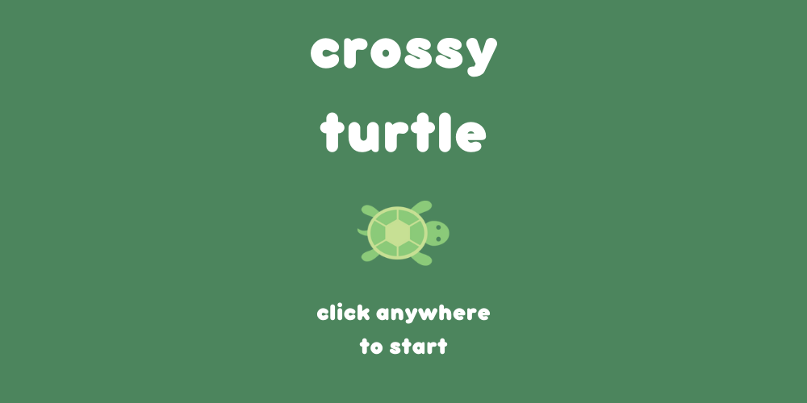

# crossy-turtle
Game and physics engine made for Caltech's CS3 (Software Design) course. Read a very detailed project report [here](https://docs.google.com/document/d/1eU0A6Cymmo2hxkLCty_bwjAHH05nrSkhn6JZ8b4gR5M/edit?usp=sharing).

<p align="center">

</p>

- A fun game (with no end other than death) in which the user has to move a turtle as far as possible, dodging all obstacles and collecting powerups and coins along the way.

- Inspired by the infamous mobile game "Crossy Road" and the adorable turtles that populate Caltech's Turtle Pond.

- Coded by Bridget Yang, Joseph Kim, Jay Siri, and Pranay Satya for our final project in Caltech's CS 3: Software Design course.

### How to Run
Clone the repo.
```
git clone https://github.com/jayyysiri/crossy-turtle.git
```

Compile with no ASan. A local link should be generated that contains the game.
```
cd crossy-turtle
make crossyturtle NO_ASAN=true
```
